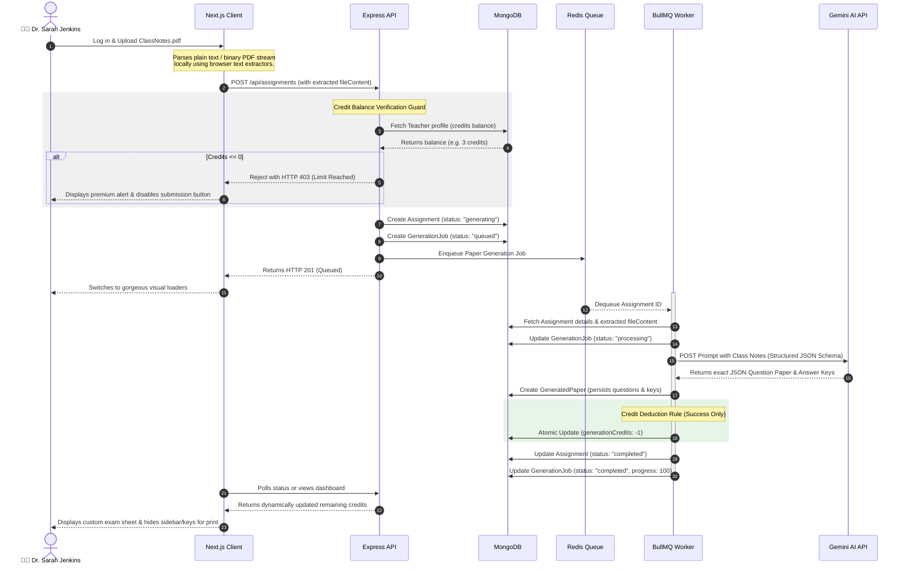

# VedaAI — Premium AI Creator Workspace for Educators

VedaAI is a production-like, AI-driven examination and assignment generator tailored for schools. It enables educators to upload class notes or textbook material, extract key concepts, specify question structures, and generate complete, ready-to-print question sheets and answer keys using structured Google Gemini models.

---

## 🏗️ System Architecture

The application is engineered as a highly decoupled, stateful multi-service environment:

```
                  ┌──────────────────────┐
                  │   Next.js Frontend   │ (Port 3000)
                  └──────────┬───────────┘
                             │ REST API
                             ▼
                  ┌──────────────────────┐
                  │ Express.js API Server│ (Port 5000)
                  └────┬────────────┬────┘
                       │            │
       Mongoose Models │            │ Enqueue Job
                       ▼            ▼
             ┌───────────┐    ┌───────────┐
             │  MongoDB  │    │   Redis   │ (Internal Only)
             │ Database  │    │  (BullMQ) │
             └─────▲─────┘    └─────┬─────┘
                   │                │
                   │                │ Read Job
                   │                ▼
             ┌─────┴────────────────┴─────┐
             │       BullMQ Worker        │ (Background Process)
             │   (gemini-2.5-flash API)   │
             └────────────────────────────┘
```

- **Frontend Client**: Built on **Next.js 16 (App Router)** and **React 19**, styled using a sleek, dark-mode/glassmorphism design system in **Vanilla TailwindCSS**, complete with print layout overrides to isolate exam papers.
- **Backend API Gateway**: Powered by **Express.js** running on the highly optimized **Bun/Node** runtime, providing robust controller validation, dynamic stats aggregate queries, and mongoose middleware.
- **Background Worker Queue**: Leverages **BullMQ** running over **Redis 7** to process high-throughput generative AI question synthesis jobs asynchronously.
- **Database Layer**: Persisted on **MongoDB 7** with strict indexing, schema validations, and transactional queries.
- **AI Synthesis**: Powered by `gemini-2.5-flash` leveraging Google Developer API's **structured JSON response schemas** (`responseMimeType: "application/json"`).

---

## 🔄 End-to-End Data & Execution Flow

Below is the detailed flow showing how text extraction, MongoDB job tracking, structured Gemini prompt generation, and **AI Credit Limits** interact:



---

## 🗃️ Database Schemas & Collections

VedaAI maintains five interconnected MongoDB collections using Mongoose models:

### 1. `User` Collection (Simulated Teacher Session)
Represents teachers, their domains, and backend-enforced credit balances.
| Field | Type | Default / Constraints | Description |
| :--- | :--- | :--- | :--- |
| `_id` | `ObjectId` | Auto | Unique identifier |
| `fullName` | `String` | Required | Full name of the educator |
| `email` | `String` | Required, lowercase | Unique email address |
| `role` | `String` | `"Teacher"` | User permission classification |
| `subject` | `String` | Required | Teaching domain (e.g., Mathematics) |
| `schoolId` | `ObjectId` | Refers to `School` | Foreign key referencing the teacher's school |
| `avatarUrl` | `String` | `""` | Premium avatar image reference |
| `generationCredits` | `Number` | `3` (Min: `0`) | **Dynamic, backend-enforced AI credits count** |

### 2. `School` Collection
Metadata representing the associated institution.
| Field | Type | Constraints | Description |
| :--- | :--- | :--- | :--- |
| `_id` | `ObjectId` | Required | Unique school identifier |
| `name` | `String` | Required | Registered school name |
| `city` | `String` | Required | Geographic city |
| `board` | `String` | Required | Educational board (e.g., CBSE, ICSE, Cambridge) |
| `logoUrl` | `String` | Optional | Visual branding logo |

### 3. `Assignment` Collection
Represents the queued request detailing specifications for the exam paper.
| Field | Type | Constraints | Description |
| :--- | :--- | :--- | :--- |
| `teacherId` | `ObjectId` | Refers to `User` | The owner/creator of the assignment |
| `schoolId` | `ObjectId` | Refers to `School` | Associated school metadata |
| `schoolName` | `String` | Required | Flat name of the school for layout |
| `title` | `String` | Auto-generated | E.g., Mathematics Assignment Jun 15 |
| `subject` | `String` | Required | Subject domain |
| `grade` | `String` | `"Grade 8"` | Grade level of the test |
| `instructions` | `String` | Optional | Custom criteria appended to Gemini prompts |
| `uploadedMaterial` | `Object` | Optional | Holds `fileName`, `fileUrl`, and extracted `fileContent` |
| `questionConfigs` | `Array` | Minimum: `1` | Configuration rules (counts, marks, difficulty) |
| `status` | `String` | `"generating"` \| `"completed"` \| `"failed"` | Overall assignment workflow state |

### 4. `GenerationJob` Collection
Monitors real-time queue loading speeds and stages.
| Field | Type | Constraints | Description |
| :--- | :--- | :--- | :--- |
| `assignmentId` | `ObjectId` | Refers to `Assignment` | Reference key |
| `status` | `String` | `"queued"` \| `"processing"` \| `"completed"` \| `"failed"` | Pipeline stage status |
| `progress` | `Number` | `0` to `100` | Percentage loading state for frontend UI bars |
| `currentStage` | `String` | Optional | Descriptive text showing active state |
| `provider` | `String` | `"gemini"` | LLM provider used |

### 5. `GeneratedPaper` Collection
The final generated examination sheet, completed with detailed section groupings and answer rubrics.
| Field | Type | Description |
| :--- | :--- | :--- |
| `assignmentId` | `ObjectId` | Refers to `Assignment` |
| `subject` / `grade` | `String` | Test header metadata |
| `sections` | `Array` | Nested questions, options, marks, and unique keys |
| `answerKey` | `Object` | Decoupled model answers and marking rubrics for teachers |

---

## 🔒 The AI Generation Limit Rule

To simulate enterprise grade production tiers:
1. **Verification**: When requesting an assignment (`POST /api/assignments`), the backend queries the database for the teacher's profile. If `generationCredits <= 0`, it instantly returns a `403 Forbidden` JSON response.
2. **Execution**: The background queue worker runs the Gemini API generator. If the AI model fails or if Redis encounters an error, **no credit is deducted**.
3. **Consumption**: Once the Gemini generator responds and the `GeneratedPaper` successfully commits to MongoDB, the worker triggers an atomic MongoDB decrement (`$inc: { generationCredits: -1 }`).
4. **Soft Alert Banners**: When a teacher hits the limit, the Next.js creation form automatically warns them with a beautiful dynamic card and disables the submission buttons without using intrusive browser popups.

---

## 🐳 Docker Deployment & Quick Start

Deploying VedaAI locally is completely automated via Docker Compose.

### Prerequisites
- **Docker** and **Docker Compose** installed.
- A **Google Gemini Developer API Key** (Optional. If not supplied, the system auto-detects and triggers the highly robust, mathematical fallback test mock generator).

---

### Step 1: Configure Environment Variables

Create the `.env` file inside the `backend` directory.

```bash
# Move to backend folder
cd backend

# Create environment configuration
cp .env.example .env
```

Open `backend/.env` and add your Gemini API Key:
```env
PORT=5000
MONGODB_URI=mongodb://mongodb:27017/vedaai
REDIS_HOST=redis
REDIS_PORT=6379
GEMINI_API_KEY=your_google_gemini_api_key_here
```

---

### Step 2: Spin Up the Services

Run Docker Compose from the `backend` directory to build and spin up MongoDB, Redis, the API server, and the queue background worker:

```bash
docker compose up -d --build
```

#### Verify Running Containers
Check that all four core containers are up and healthy:
```bash
docker ps
```
You should see:
- `vedaai-backend` running on port `5000`
- `vedaai-worker` running the BullMQ task handlers
- `vedaai-mongodb` running standard Mongo
- `vedaai-redis` running internal cache and queue channels

---

### Step 3: Run the Frontend Server

Go back to the root and navigate to the Next.js `frontend` directory. Install its packages and launch the hot-reload server locally:

```bash
# Go to frontend folder
cd ../frontend

# Install dependencies using Bun, Npm, or Yarn
bun install  # or npm install

# Start Next.js hot-reloading dev environment
bun run dev  # or npm run dev
```

---

### Step 4: Access the Creator Workspace

1. Open your browser and navigate to: **[http://localhost:3000](http://localhost:3000)**.
2. The site will automatically redirect to the **`/login`** route.
3. Click the premium **"Login as Dr. Sarah Jenkins"** simulated context button.
4. You will instantly enter the creator workspace at `/assignments/create` with a fully loaded balance of **`3 / 3` AI credits** ready to generate!
